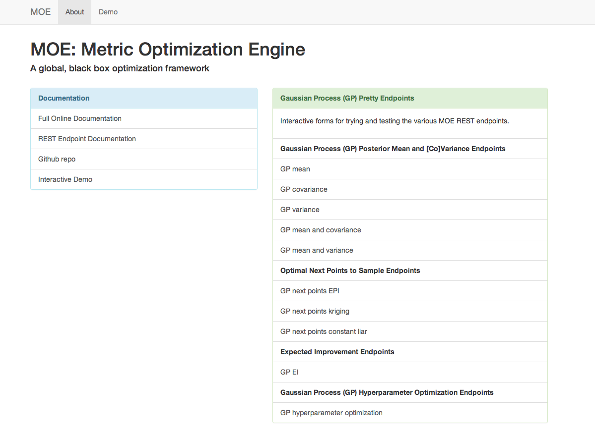
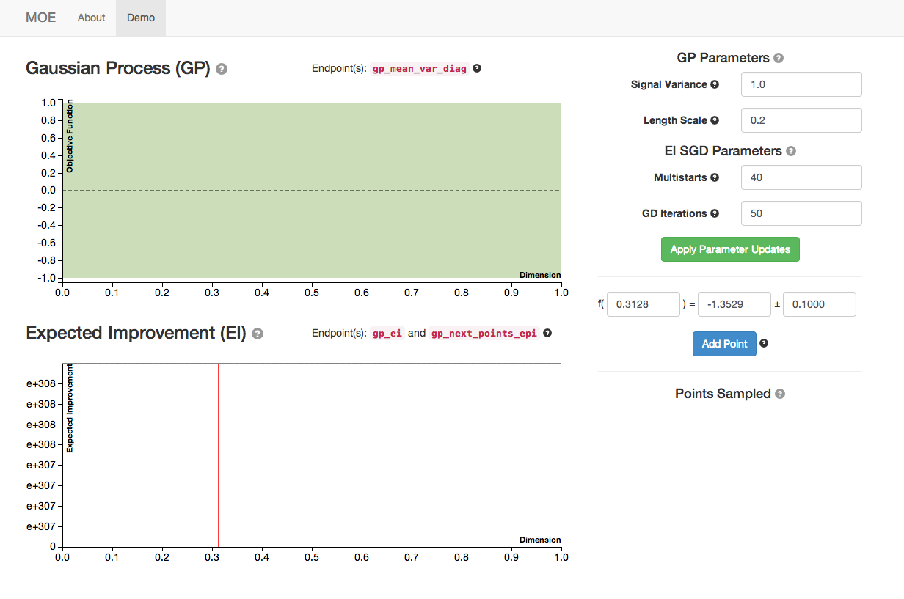
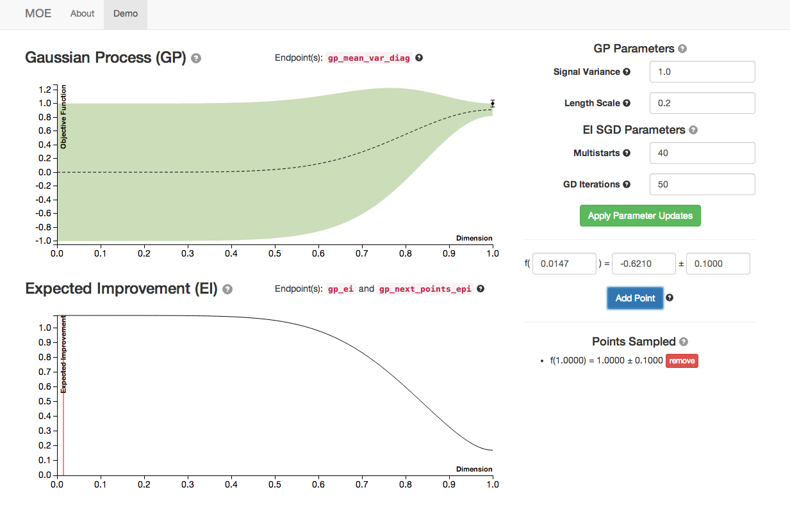
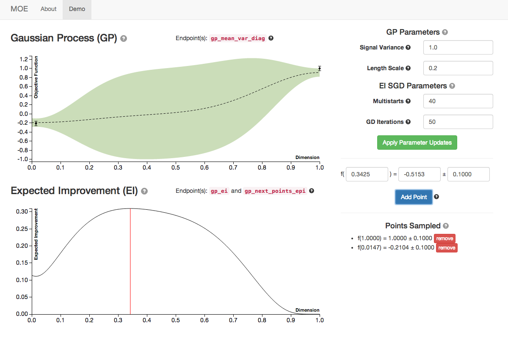
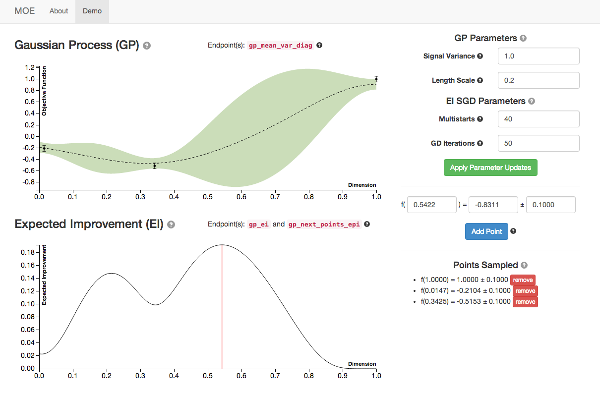
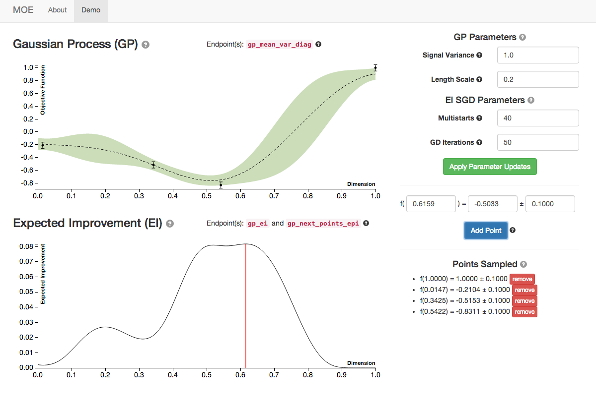
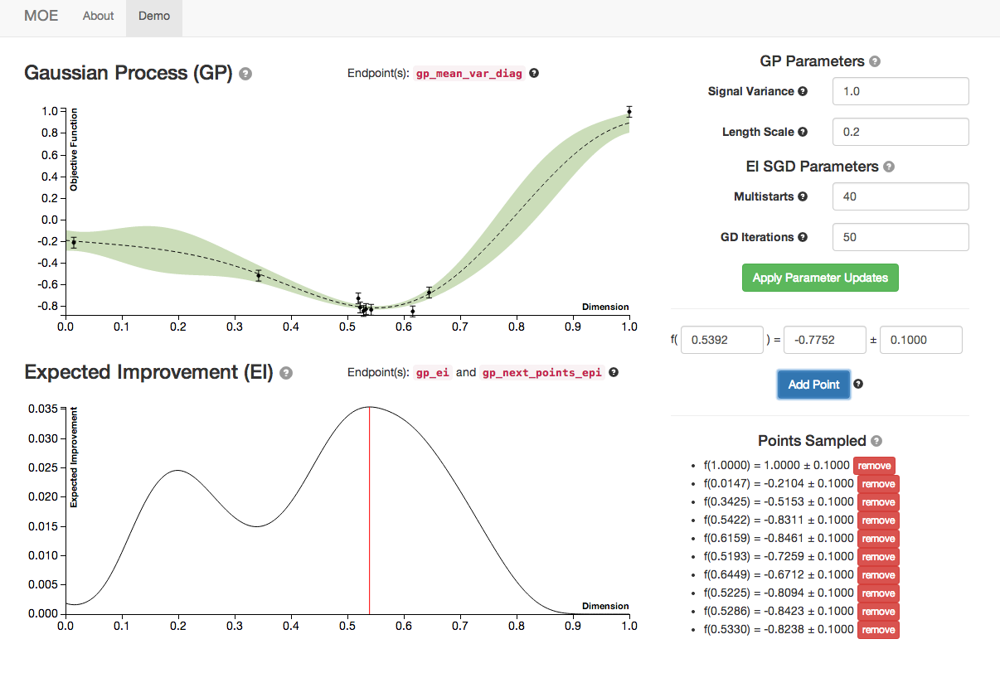
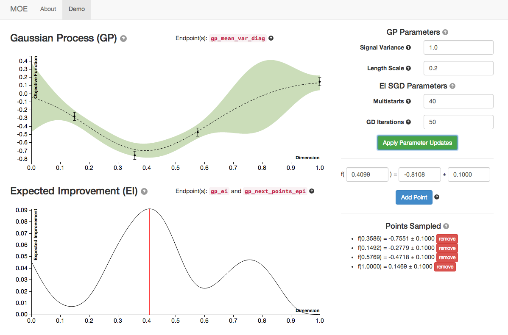
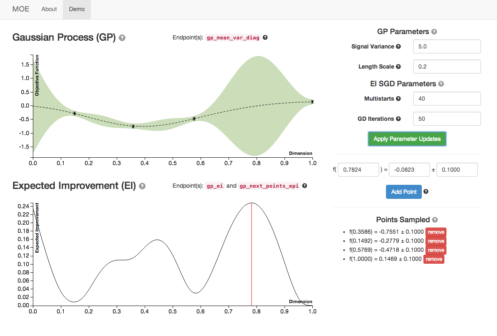
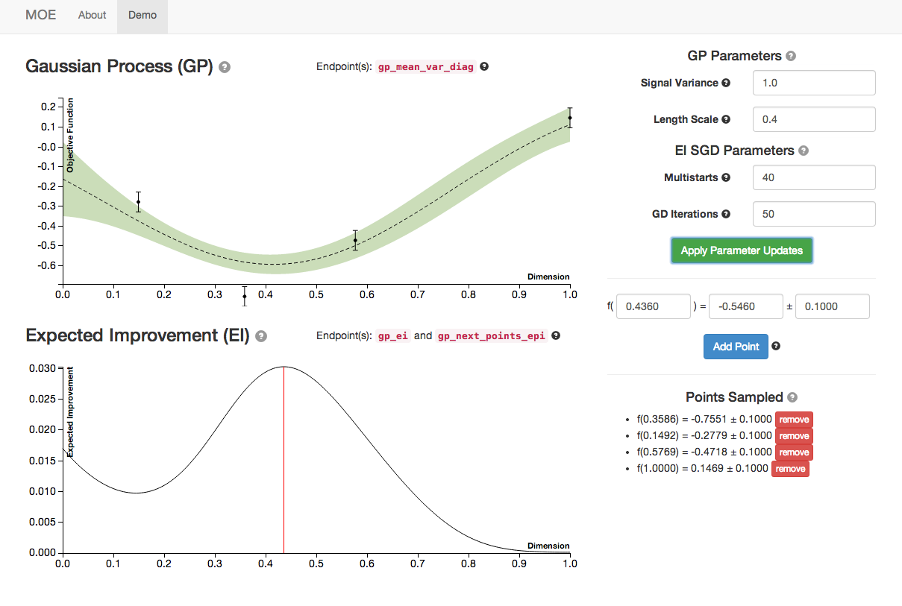

Demo Tutorial
=============

MOE provides a Graphical User Interface for exploration of the various endpoints and components of the underlying system. After going through the :doc:`install` in docker this interface is running at http://localhost:6543.

This includes link to:

    #. All `docs`_ and `the repo`_
    #. :doc:`pretty_endpoints`
    #. The demo, which will be covered here.

.. _docs: http://yelp.github.io/MOE
.. _the repo: http://www.github.com/Yelp/MOE

The Interactive Demo
--------------------

The GUI includes a demo for visualizing Gaussian Processes written in d3 and using various endpoints from the REST interface.

This view has several components (check out the tooltips for specific components):

 * The graph labeled **Gaussian Process (GP)** is the posterior mean and variance of the GP given the historical data and parameters (on right). The dashed line is the posterior mean, the faded area is the variance, for each point in [0,1].
 * The graph labeled **Expected Improvement (EI)** is a plot of EI for each potential next point to sample in [0,1]. The red line corresponds to the point of highest EI within the domain. This is the point that MOE suggest we sample next to optimize the EI.
 * On the right are various hyperparameters of the GP covariance and the parameters of the Stochastic Gradient Descent algorithm that we use to optimize EI.
 * On the bottom right we can specify new historical points to update the GP. By default the GUI suggests the point of highest EI and generates a value for the point drawn from the GP prior.

Sampling Points
...............

By sampling several points (the blue button)  we can see the plots of GP and EI evolving.

For more information on how this is done check out:

    - :doc:`gpp_math`
    - :mod:`moe.views.rest.gp_mean_var`
    - `RW Chapter 2`_
    - :doc:`gpp_expected_improvement_demo`
    - :mod:`moe.views.rest.gp_ei`
    - `EGO Paper`_

.. _RW Chapter 2: http://www.gaussianprocess.org/gpml/chapters/RW2.pdf
.. _EGO Paper: http://www.ressources-actuarielles.net/EXT/ISFA/1226.nsf/0/f84f7ac703bf5862c12576d8002f5259/$FILE/Jones98.pdf

We see the Gaussian Process evolve as more points are sampled from it. Note how the Expected Improvement graph also changes as more historical information is given to MOE. By sampling the point with highest EI at every step MOE is able to quickly zoom in to the global optima of this function (near 0.529).

.. _changing-hypers:

Changing Hyperparameters
........................

By manipulating the hyperparameters of the Gaussian Process we can change the underlying covariance kernel, and how the GP models the underlying objective function.

For more information on how this is done internally check out:

    - :doc:`gpp_covariance`
    - :doc:`gpp_model_selection`
    - :mod:`moe.views.rest.gp_hyper_opt`
    - `RW Chapter 4`_
    - `RW Chapter 5`_

.. _RW Chapter 4: http://www.gaussianprocess.org/gpml/chapters/RW4.pdf
.. _RW Chapter 5: http://www.gaussianprocess.org/gpml/chapters/RW5.pdf

Below is an example of 3 different sets of hyperparameters with the same historical points sampled. Notice how the GP posterior mean and variance change as we modify the length scale and signal variance.

Here are the plots with default hyperparameters.

As we increase signal variance we changes in the GP plot as well as a shift in the point of highest EI. This parameter is a measure of the underlying uncertainty of the GP prior.

As we increase the length scale we see the GP plot change again. This parameter is a measure of how closely correlated points are. Higher length scales can result in underfitting, lower length scales can result in overfitting.

MOE provides functionality for finding the optimal GP hyperparameters, given the historical data, in :mod:`moe.views.rest.gp_hyper_opt`.

