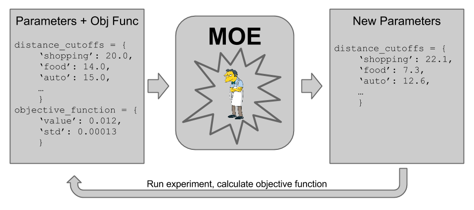

Examples
======

Below are some examples for use cases in which MOE can provide value

**Contents:**

    #. `Minimizing an arbitrary function`_
    #. `Gaussian Process regression given historical data`_
    #. `Hyperparameter optimization of a Gaussian Process`_
    #. `All above examples combined`_
    #. `Setting thresholds for advertising units`_

Minimizing an arbitrary function
----

This example can be found in ``<MOE_DIR>/examples/next_point_via_simple_endpoint.py``

In this example we use :mod:`moe.easy_interface.simple_endpoint` to use the endpoint :mod:`moe.views.rest.gp_ei`.

First we define an arbitrary function to minimize,

.. code-block:: python

    def function_to_minimize(x):
        """Calculate an aribitrary 2-d function with some noise.

        This function has a minimum near [1, 2.6].
        """
        return math.sin(x[0]) * math.cos(x[1]) + math.cos(x[0] + x[1]) + random.uniform(-0.02, 0.02)

.. Note:

    We can substitute this arbitrary function with any function that we wish to minimize (like log likelihood of a machine learning model) or any function that we want to maximize (like a map reduce job that calculates expected revenue given auction system constants, we just multiply the output by -1 to change a maximization problem into a minimization problem). For more examples of potential objective functions see :doc:`objective_functions`.

Then we set up an instance of :class:`moe.easy_interface.experiment.Experiment` and feed it some historical data,

.. code-block:: python

    exp = Experiment([[0, 2], [0, 4]])  # 2D experiment, we build a tensor product domain
    # Bootstrap with some known or already sampled point(s)
    exp.historical_data.append_sample_points([
        SamplePoint([0, 0], function_to_minimize([0, 0]), 0.05),  # Iterables of the form [point, f_val, f_var] are also allowed
        ])

With this given historical data we can now start to query MOE for the next best points to sample, maximizing the expected improvement over the domain of our experiment.

.. code-block:: python

    # Use MOE to determine what is the point with highest Expected Improvement to use next
    next_point_to_sample = gp_next_points(exp)[0]  # By default we only ask for one point

We can now sample this point that MOE suggests and add it to our historical data,

.. code-block:: python

    # Sample the point from our objective function, we can replace this with any function
    value_of_next_point = function_to_minimize(next_point_to_sample)
    # Add the information about the point to the experiment historical data to inform the GP
    exp.historical_data.append_sample_points([SamplePoint(next_point_to_sample, value_of_next_point, 0.01)])  # We can add some noise

By looping over this process many times we converge to the best set of parameters that minimize the above function.

For examples of more options we can pass this endpoint see the documentation here: :mod:`moe.views.rest.gp_next_points_epi`.

We can also use other GP optimization methods:

    * :mod:`moe.views.rest.gp_next_points_epi`
    * :mod:`moe.views.rest.gp_next_points_kriging`
    * :mod:`moe.views.rest.gp_next_points_constant_liar`

Gaussian Process regression given historical data
----

This example can be found in ``<MOE_DIR>/examples/mean_and_var_of_gp_from_historic_data.py``

In this example we use :mod:`moe.easy_interface.simple_endpoint` to use the endpoint :mod:`moe.views.rest.gp_mean_var`. We will be calculating the posterior mean and variance of a Gaussian Process (GP) given some historical data.

First we sample some random points. This will be our historical data. You could replace these with the outputs the system you want to perform Gaussian Process Regression on (`RW Chapter 2`_).

.. _RW Chapter 2: http://www.gaussianprocess.org/gpml/chapters/RW2.pdf

.. code-block:: python

    # Randomly generate some historical data
    # points_sampled is an iterable of iterables of the form [point_as_a_list, objective_function_value, value_variance]
    points_sampled = [
            [[x], random.uniform(-1, 1), 0.01] for x in numpy.arange(0, 1, 0.1)
            ]

Next we set the points we wish to evaluate the mean and variance at and hit the endpoint (:mod:`moe.views.rest.gp_mean_var`),

.. code-block:: python

    points_to_evaluate = [[x] for x in numpy.arange(0, 1, 0.05)]  # uniform grid of points
    mean, var = gp_mean_var(
            points_sampled,  # Historical data to inform Gaussian Process
            points_to_evaluate,  # We will calculate the mean and variance of the GP at these points
            )

The mean vector and covariance matrix is now available for printing, plotting or analysis in the variables ``mean`` and ``var``.

For examples of more options we can pass this endpoint see the documentation here: :mod:`moe.views.rest.gp_mean_var`.

Hyperparameter optimization of a Gaussian Process
----

This example can be found in ``<MOE_DIR>/examples/hyper_opt_of_gp_from_historical_data.py``

In this example we use :mod:`moe.easy_interface.simple_endpoint` to use the endpoint :mod:`moe.views.rest.gp_hyper_opt`. It calculates the optimal hyperparameters for a Gaussian Process given historical data.

.. code-block:: python

    points_sampled = [
            SamplePoint([x], random.uniform(-1, 1), 0.01) for x in numpy.arange(0, 1, 0.1)
            ]
    covariance_info = gp_hyper_opt(
            points_sampled,
            )
    print covariance_info

For examples of more options we can pass this endpoint see the documentation here: :mod:`moe.views.rest.gp_hyper_opt`.

All above examples combined
----

This example can be found in ``<MOE_DIR>/examples/combined_example.py``

In this example we use :mod:`moe.easy_interface.simple_endpoint` to use the endpoints :mod:`moe.views.rest.gp_next_points_epi`, :mod:`moe.views.rest.gp_mean_var`, :mod:`moe.views.rest.gp_hyper_opt`.

See the code for the full example, and the individual endpoints for examples on more options for each.

Setting thresholds for advertising units
----

This example was refrenced in

    * `15 min MOE intro video`_
    * `MOE intro slides`_

.. _15 min MOE intro video: http://www.youtube.com/watch?v=qAN6iyYPbEE

.. _MOE intro slides: http://www.slideshare.net/YelpEngineering/yelp-engineering-open-house-112013-optimally-learning-for-fun-and-profit

When showing advertisements on Yelp we have a fixed size ad unit. There is a tradeoff between showing more reviewer information and other types of information to the user. In general Yelp currently shows 3 lines of dynamic content (distance info, category info, review info, etc)

For example, if I am looking for a pizza place at midnight on my phone I mostly care that they serve pizza and are close to me, having 1 line of distance information and only 2 lines of reviewer text is fine. If I am looking for a plumber on my desktop I may care more about what other users have to say, and may care less about where the plumber is located (especially if they are going to be coming to me), so 3 lines of review text is best.

MOE can help us find the best thresholds for each category (or category, device, time, etc tuple) for when to show distance info and 2 lines of review text, or just 3 lines of review text. We could use Click Through Rate (CTR) or revenue or any objective function to optimize. For examples of objective functions and their properties see :doc:`objective_functions`.

This allows us to make the following "MOE loop",

.. Note:

    These parameters were made up for this figure, they do not represent real values in production at Yelp.

Using the historical data we can iteratively find the best set of parameters to test via several sequential rounds of A/B tests. This allows us to readily explore the space in an optimal way across many possible tuples.
