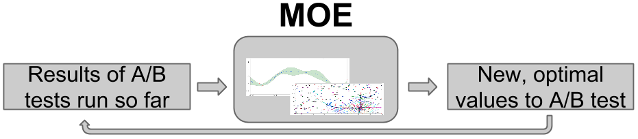

Welcome to MOE's documentation!
===============================

**Contents:**

    #. `Github repo`_
    #. `What is MOE?`_
    #. `Quick Install`_ and :doc:`Full Install </install>`
    #. `Quick Start`_
    #. `Source Documentation`_
    #. :doc:`Contributing </contributing>`

.. _Github repo: https://github.com/sc932/MOE

What is MOE?
------------

MOE (Metric Optimization Engine) is an *efficient* way to optimize a system's parameters, when evaluating parameters is *time-consuming* or *expensive*.

Here are some examples of when you could use MOE:

* **Optimizing a system's click-through rate (CTR).**  MOE is useful when evaluating CTR requires running an A/B test on real user traffic, and getting statistically significant results requires running this test for a substantial amount of time (hours, days, or even weeks).

* **Optimizing tunable parameters of a machine-learning prediction method.**  MOE is useful if calculating the prediction error for one choice of the parameters takes a long time, which might happen because the prediction method is complex and takes a long time to train, or because the data used to evaluate the error is huge.

* **Optimizing the design of an engineering system** (an airplane, the traffic network in a city, a combustion engine, a hospital).  MOE is useful if evaluating a design requires running a complex physics-based numerical simulation on a supercomputer. 

* **Optimizing the parameters of a real-world experiment** (a chemistry, biology, or physics experiment, a drug trial).  MOE is useful when every experiment needs to be physically created in a lab, or very few experiments can be run in parallel.

MOE is ideal for problems in which the optimization problem's objective function is a black box, not necessarily convex or concave, derivatives are unavailable, and we seek a global optimum, rather than just a local one. This ability to handle black-box objective functions allows us to use MOE to optimize nearly any system, without requiring any internal knowledge or access. To use MOE, we simply need to specify some :doc:`objective function </objective_functions>`, some set of :doc:`parameters </objective_functions>`, and any historical data we may have from previous evaluations of the objective function. MOE then finds the set of parameters that maximize (or minimize) the objective function, while evaluating the objective function as little as possible. 

Inside, MOE uses *Bayesian global optimization*, which performs optimization using Bayesian statistics and *optimal learning*. 

Optimal learning is the study of efficient methods for collecting information, particularly when doing so is time-consuming or expensive, and was developed and popularized from its roots in decision theory by `Prof. Peter Frazier`_ (`Cornell, Operations Research and Information Engineering`_) and `Prof. Warren Powell`_ (`Princeton, Operations Research and Financial Engineering`_). For more information about the mathematics of optimal learning, and more real-world applications like heart surgery, drug discovery, and materials science, see these `intro slides`_ to optimal learning.

.. _Prof. Peter Frazier: http://people.orie.cornell.edu/pfrazier/
.. _Cornell, Operations Research and Information Engineering: http://www.orie.cornell.edu/
.. _Prof. Warren Powell: http://optimallearning.princeton.edu/
.. _Princeton, Operations Research and Financial Engineering: http://orfe.princeton.edu/
.. _intro slides: http://people.orie.cornell.edu/pfrazier/Presentations/2014.01.Lancaster.BGO.pdf

**Example**:

To illustrate how MOE works, suppose we wish to maximize the click-through-rate (CTR) on a website we manage, by varying some real-valued parameter vector :math:`\vec{x}` that govern how site content is presented to the user.  Evaluating the CTR for a new set of parameters requires running an A/B test over a period of several days.  We write this problem mathematically as,

.. math::

    \underset{\vec{x}}{\mathrm{argmax}} \ \text{CTR} (\vec{x}).

We want to find the best set of parameters :math:`\vec{x}` while evaluating the underlying function (CTR) as few times as possible. See :doc:`Objective Functions </objective_functions>` for more examples of objective functions and the best ways to combine metrics.

MOE builds the following loop, in which it takes the results from those A/B tests that have been run so far, processes them through its internal engine, and then determines at which parameter vector :math:`\vec{x}` it would be most valuable to next observe the CTR.  MOE runs an A/B test at this new parameter vector, and then repeats the loop.

This choice of the most valuable point trades a desire to evaluate points where we have a lot of uncertainty about the CTR (this is called *exploration*), and to evaluate points where we think the CTR is large (this is called *exploitation*).

By continuing to optimize over many iterations, MOE quickly finds approximate optima, or points with large CTR.  As the world changes over time, MOE can surf these shifting optima as they move, staying at the peak of the potentially changing objective function in parameter space as time advances.

For more examples on how MOE can be used see :doc:`examples`

Video and slidedeck introduction to MOE:

    * `15 min MOE intro video`_
    * `MOE intro slides`_

.. _15 min MOE intro video: http://www.youtube.com/watch?v=qAN6iyYPbEE
.. _MOE intro slides: http://www.slideshare.net/YelpEngineering/yelp-engineering-open-house-112013-optimally-learning-for-fun-and-profit

MOE does this internally by:

1. Building a Gaussian Process (GP) with the historical data

    - :doc:`gpp_math`
    - :mod:`moe.views.rest.gp_mean_var`
    - `RW Chapter 2`_

2. Optimizing the hyperparameters of the Gaussian Process (model selection)

    - :doc:`gpp_covariance`
    - :doc:`gpp_model_selection`
    - :mod:`moe.views.rest.gp_hyper_opt`
    - `RW Chapter 4`_
    - `RW Chapter 5`_

3. Finding the point(s) of highest Expected Improvement (EI)

    - :doc:`gpp_expected_improvement_demo`
    - :mod:`moe.views.rest.gp_ei`
    - `EGO Paper`_

4. Returning the points to sample, then repeat

.. _RW Chapter 2: http://www.gaussianprocess.org/gpml/chapters/RW2.pdf
.. _RW Chapter 4: http://www.gaussianprocess.org/gpml/chapters/RW4.pdf
.. _RW Chapter 5: http://www.gaussianprocess.org/gpml/chapters/RW5.pdf
.. _EGO Paper: http://www.ressources-actuarielles.net/EXT/ISFA/1226.nsf/0/f84f7ac703bf5862c12576d8002f5259/$FILE/Jones98.pdf

Externally you can use MOE through:

    * :doc:`The REST interface </moe.views.rest>`
    * :doc:`The python interface </moe.optimal_learning.python.python_version>`
    * :doc:`The C++ interface </cpp_tree>`
    * The CUDA kernels.

You can be up and optimizing in a matter of minutes.

Quick Install
-------------

Install in docker:
..................

This is the recommended way to run the MOE REST server. All dependencies and building is done automatically and in an isolated container.

Docker (http://docs.docker.io/) is a container based virtualization framework. Unlike traditional virtualization Docker is fast, lightweight and easy to use. Docker allows you to create containers holding all the dependencies for an application. Each container is kept isolated from any other, and nothing gets shared.

::

    $ git clone https://github.com/sc932/MOE.git
    $ cd MOE
    $ docker build -t moe_container .
    $ docker run -p 6543:6543 moe_container

The webserver and REST interface is now running on port 6543 from within the container.

Build from source (linux and OSX 10.8 and 10.9 supported)
.........................................................

:doc:`Full Install </install>`

Quick Start
-----------

REST/web server and interactive demo
....................................

To get the REST server running locally, from the directory MOE is installed:

::

    $ pserve --reload development.ini

In your favorite browser go to: http://127.0.0.1:6543/

Or, from the command line,

::

    $ curl -X POST -H "Content-Type: application/json" -d '{"domain_info": {"dim": 1}, "points_to_evaluate": [[0.1], [0.5], [0.9]], "gp_info": {"points_sampled": [{"value_var": 0.01, "value": 0.1, "point": [0.0]}, {"value_var": 0.01, "value": 0.2, "point": [1.0]}]}}' http://127.0.0.1:6543/gp/ei

``gp_ei`` endpoint documentation: :mod:`moe.views.rest.gp_ei`

From ipython
............

::

    $ ipython
    > from moe.easy_interface.experiment import Experiment
    > from moe.easy_interface.simple_endpoint import gp_next_points
    > exp = Experiment([[0, 2], [0, 4]])
    > exp.historical_data.append_sample_points([[0, 0], 1.0, 0.01])
    > next_point_to_sample = gp_next_points(exp)
    > print next_point_to_sample

``easy_interface`` documentation: :doc:`moe.easy_interface`

Within python
.............

See :mod:`moe_examples.next_point_via_simple_endpoint` or :doc:`examples` for more examples.

.. code-block:: python

    import math
    import random

    from moe.easy_interface.experiment import Experiment
    from moe.easy_interface.simple_endpoint import gp_next_points
    from moe.optimal_learning.python.data_containers import SamplePoint

    # Note: this function can be anything, the output of a batch, results of an A/B experiment, the value of a physical experiment etc.
    def function_to_minimize(x):
        """Calculate an aribitrary 2-d function with some noise with minimum near [1, 2.6]."""
        return math.sin(x[0]) * math.cos(x[1]) + math.cos(x[0] + x[1]) + random.uniform(-0.02, 0.02)

    if __name__ == '__main__':
        exp = Experiment([[0, 2], [0, 4]])  # 2D experiment, we build a tensor product domain
        # Bootstrap with some known or already sampled point(s)
        exp.historical_data.append_sample_points([
            SamplePoint([0, 0], function_to_minimize([0, 0]), 0.05),  # Iterables of the form [point, f_val, f_var] are also allowed
            ])

        # Sample 20 points
        for i in range(20):
            # Use MOE to determine what is the point with highest Expected Improvement to use next
            next_point_to_sample = gp_next_points(exp)[0]  # By default we only ask for one point
            # Sample the point from our objective function, we can replace this with any function
            value_of_next_point = function_to_minimize(next_point_to_sample)

            print "Sampled f({0:s}) = {1:.18E}".format(str(next_point_to_sample), value_of_next_point)

            # Add the information about the point to the experiment historical data to inform the GP
            exp.historical_data.append_sample_points([SamplePoint(next_point_to_sample, value_of_next_point, 0.01)])  # We can add some noise

Within C++
..........

Examples:

    1. :doc:`gpp_expected_improvement_demo`
    2. :doc:`gpp_hyperparameter_optimization_demo`
    3. :doc:`gpp_hyper_and_EI_demo`

Source Documentation
====================

Documentation
-------------

.. toctree::
   :maxdepth: 2

   why_moe.rst
   install.rst
   moe_math.rst
   demo_tutorial.rst
   pretty_endpoints.rst
   objective_functions.rst
   examples.rst
   contributing.rst
   faq.rst

Python Files
------------

.. toctree::
   :maxdepth: 4

   moe
   moe_examples

C++ Files
---------

.. toctree::
   :maxdepth: 3

   cpp_tree.rst

Indices and tables
==================

* :ref:`genindex`
* :ref:`modindex`
* :ref:`search`
