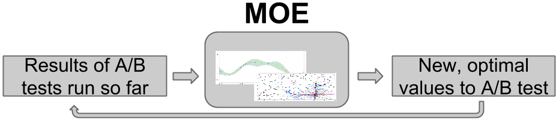

How does MOE work?
==================

**Steps toward optimization:**

    #. Build a Gaussian Process (GP) with the historical data
    #. Optimize the hyperparameters of the Gaussian Process
    #. Find the point(s) of highest Expected Improvement (EI)
    #. Return the point(s) to sample, then repeat

This section has been given as `a 15 minute talk`_ with `slides`_ as well.

.. _a 15 minute talk: http://www.youtube.com/watch?v=qAN6iyYPbEE
.. _slides: http://www.slideshare.net/YelpEngineering/yelp-engineering-open-house-112013-optimally-learning-for-fun-and-profit

This section will use examples generated from the :doc:`demo_tutorial` included with MOE.

Build a Gaussian Process (GP) with the historical data
------------------------------------------------------

Optimize the hyperparameters of the Gaussian Process
----------------------------------------------------

Find the point(s) of highest Expected Improvement (EI)
------------------------------------------------------

Return the point(s) to sample, then repeat
------------------------------------------

By continuing to optimize over many iterations, MOE quickly finds approximate optima, or points with large CTR.  As the world changes over time, MOE can surf these shifting optima as they move, staying at the peak of the potentially changing objective function in parameter space as time advances.

For more examples on how MOE can be used see :doc:`examples`, or see :doc:`why_moe` for information about how MOE is useful for these kinds of problems and some alternate methods.
