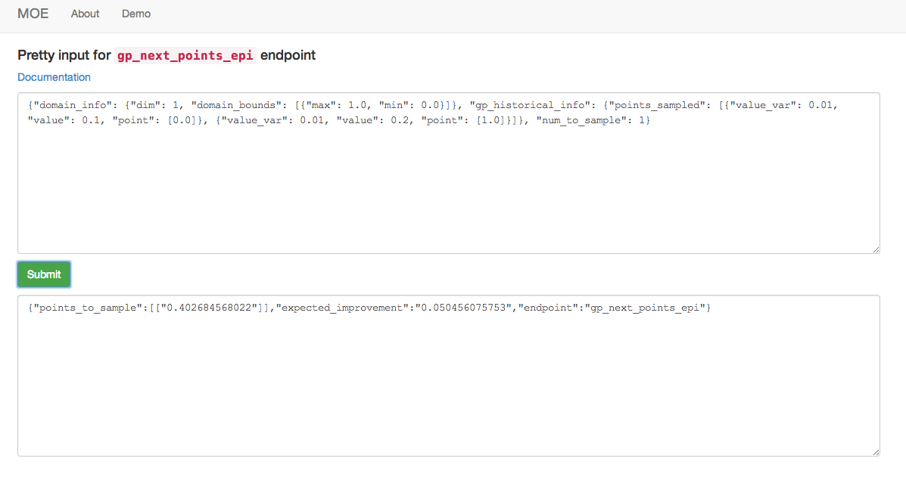

Pretty Endpoints
================

MOE provides a Graphical User Interface for exploration of the various endpoints and components of the underlying system. After going through the :doc:`install` in docker this interface is running at http://localhost:6543. This includes the pretty endpoints and the :doc:`demo_tutorial`

Each pretty point is a form-based webpage that allows users to interactively explore each REST endpoint. Below is an example of the pretty endpoint for ``/gp/next_points/epi``:

Each REST endpoint has a corresponding pretty endpoint. One can access the pretty version by appending ``/pretty`` to the route and opening it in any web browser. This allows the user to explore various parameters and requests interactively, before writing client code like those provided in the :doc:`examples`.
